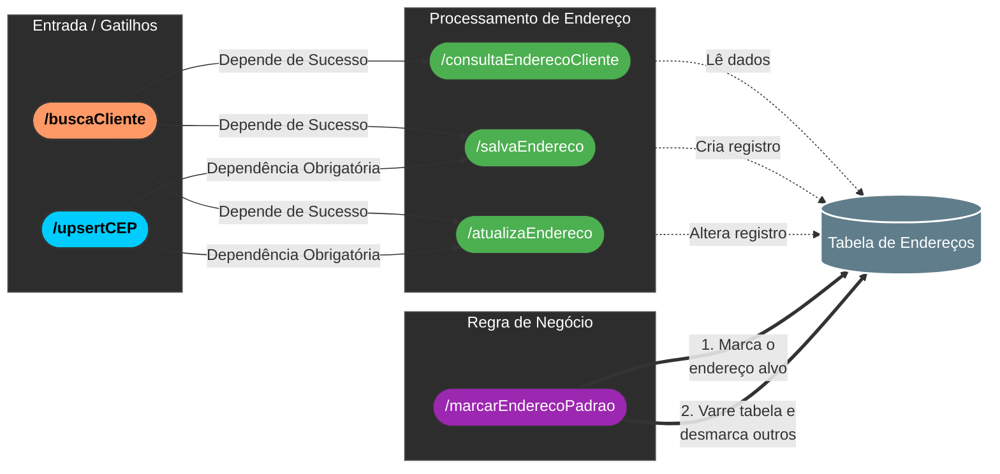

# Lista das APIs

- [ ] APIs de CRUD básicas (criadas automaticamente junto com as tabelas)
    - `GET`, `POST`, `DELETE id`, `GET id` e `PATCH id`

- [ ] APIs de autenticação (criadas junto da criação do workspace no Xano). A partir da tabela `user` padrão[^6], três APIs estão disponíveis para uso:
    - `/auth/login` devolve um `authToken` para alguém já cadastrado
    - `/auth/signup` cadastra usuário e devolve um `authToken` [^1]
    - `/auth/me/{authToken}` dado um authToken, devolve o usuário associado à ele

- SNIPPETs importados (15)
    - [ ] `/consultaCEP` dado um número de cep, devolve cep, localidade, estado, etc.
    - [ ] `/SendGrid_Email` {from, to, subject, content} devolve o status do envio

**APIs Customizadas**

- [ ] `/buscaCEP`. Recebe um CEP (texto) e busca na tabela CEP. Se encontrar, devolve o registro; se não, devolve null. Serve para evitar o "Query All" (buscar tudo) que seria lento. (16)

- [ ] `/buscaCliente` (ou `/consultaCliente`). Recebe `authToken`, chama internamente `/auth/me` para pegar o `user_id`, e então busca na tabela Cliente. É a base para quase todas as outras APIs. (16/17)

- [ ] `/upsertCEP`. Recebe {cep, cidade, estado}. Se o CEP existe, faz PATCH (atualiza); se não, faz POST (insere). Sempre retorna o registro do CEP (com o id). (17)

- [ ] `/cadastraCliente` Fluxo de 4 etapas: Recebe dados do cliente e cadastra um novo usuário para login e já cria o perfil de cliente vinculado a ele na mesma operação. (17)

- [ ] `/consultaEnderecoCliente`. Recebe `authToken`, descobre quem é o cliente (via `/buscaCliente`) e lista os endereços. Usa um Addon para trazer os dados do CEP junto com o endereço. (18)

- [ ] `/salvaEndereco`. Recebe dados do endereço + CEP. Primeiro chama `/upsertCEP` para garantir que o CEP existe e obter o `cep_id`, depois faz POST na tabela `ENDERECO`. (18)

- [ ] `/atualizaEndereco`. Similar ao anterior, mas faz PATCH na tabela ENDERECO usando o `endereco_id`. Também usa o `/upsertCEP` internamente. (18)

- [ ] `/marcarEnderecoPadrao`. Torna um endereço `padrão = true` e, via lógica de Array Map, define todos os outros endereços do mesmo cliente como `padrão = false`. (18)

[^1]: Um authToken é utilizado para provar que as futuras requisições pertencem à mesma pessoa que fez login naquela sessão.
[^6]: Tabelas a serem usadas para autenticação de usuários devem possuir campo de `Email` (tipo text) e um campo de `Password` (tipo password).

