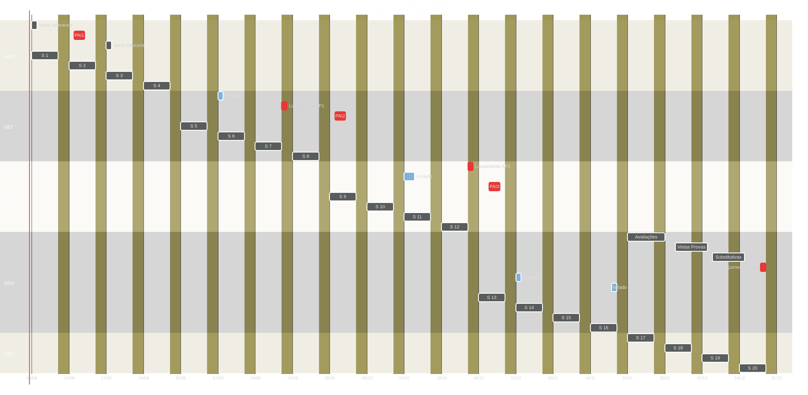

<!-- .slide: data-background-image="https://images.squarespace-cdn.com/content/v1/5fb4ea8933ae6c208c3dac41/1656395530398-NQT3HSOMM2GVD84P8FXM/car2car" data-background-size="cover" data-background-opacity="0.4" -->

# Apresentação da Disciplina

## Automação de Testes de Software

---

⚠️ Ver planos de aula e de ensino no classroom.

---

## Habilidades

Com base no mapa de conteúdos fornecido, as habilidades a serem adquiridas são:

* **Fundamentos e Estratégia de Testes:** Compreensão da pirâmide de testes, diferenciação entre testes funcionais e não funcionais, e aplicação das abordagens caixa-preta, caixa-cinza e caixa-branca.
* **Testes Unitários em Python:** Criação e execução de casos de teste, uso de métodos de asserção e tratamento/análise de exceções utilizando `unittest`.
* **Testes Automatizados com PyTest:** Estruturação e execução de suítes de teste, além do manuseio avançado de *fixtures* e parametrização.
* **Uso de Dublês de Teste (Mocks):** Aplicação prática da biblioteca `unittest.mock` e diferenciação entre Mocks, Stubs, Fakes, Spies e Dummies.

---

* **Metodologia TDD:** Aplicação do ciclo *Red-Green-Refactor* e estruturação de testes utilizando o padrão *Arrange-Act-Assert* (AAA).
* **Automação de Interface Web (Selenium):** Localização de elementos (CSS, ID, etc.), gerenciamento de esperas (implícitas/explícitas) e implementação da arquitetura *Page Object Model* (POM).
* **Automação de Interface Desktop (PyAutoGUI):** Automação de tarefas do sistema operacional e interações com interfaces gráficas de usuário (GUI).
* **Testes de APIs:** Validação e verificação de pontos de extremidade (endpoints) e serviços web.

---

* **Desenvolvimento Guiado por Comportamento (BDD):** Escrita de cenários em sintaxe Gherkin, integração com frameworks `pytest-bdd` e `behave`, e execução de testes de aceitação em aplicações web (ex.: Flask).
* **Testes de Carga e Desempenho:** Simulação de tráfego, análise de métricas e automação de testes de carga com o Locust.
* **Integração e Entrega Contínuas (CI/CD):** Criação e automação de *pipelines* de testes contínuos utilizando o GitHub Actions.

---

## Critérios de avaliação

Duas notas de Avaliações Parciais (APs), sendo que cada AP pode ser constituída por notas de atividades pelo professor no Plano de Aula. 
O aluno tem direito a uma Prova Substitutiva sobre todo o conteúdo da disciplina a fim de substituir a Prova Semestral. A nota da Prova Substitutiva somente será utilizada se for maior do que a nota da Prova.

```
Nota Final = 30% MAC + 40% Prova + 30% MPAI

SE (Nota Final >= 6,0 e Frequência >= 75%)
    ENTÃO   
        APROVADO
    SENAO
        REPROVADO
```

---

## Calendário acadêmico

